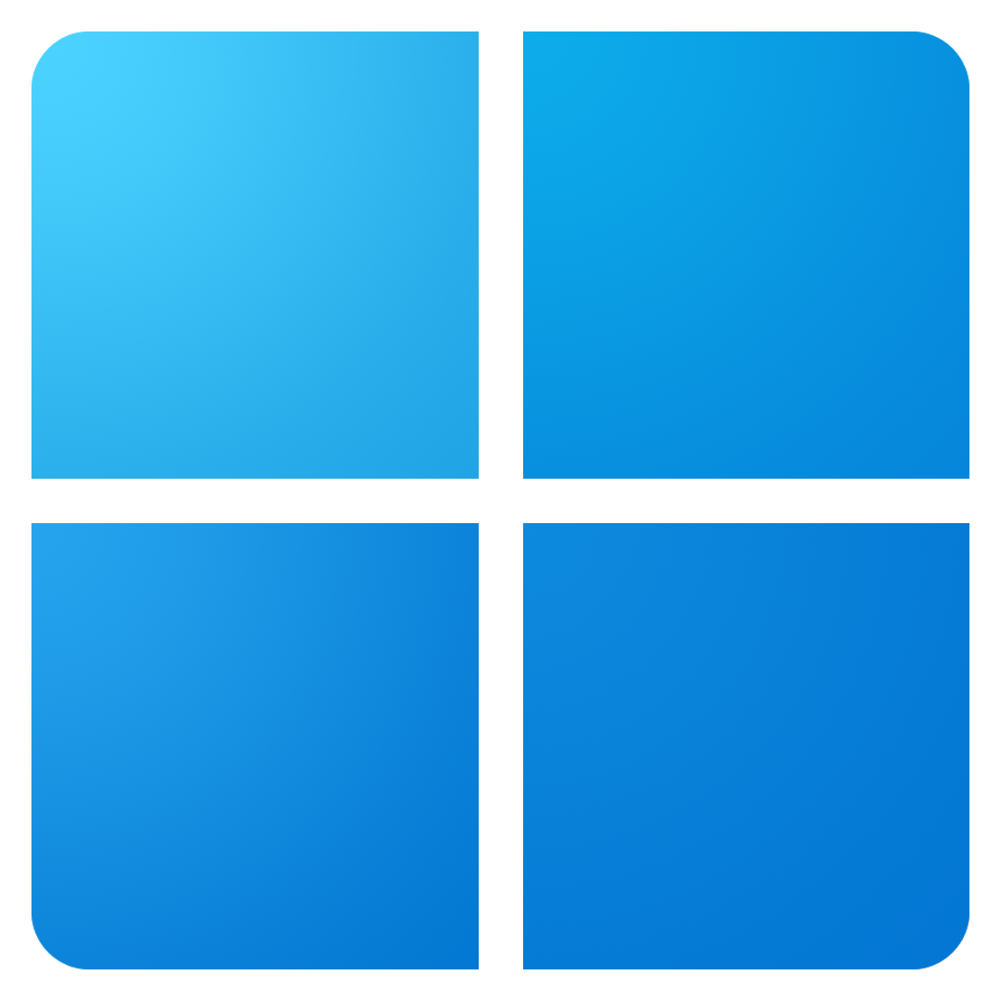
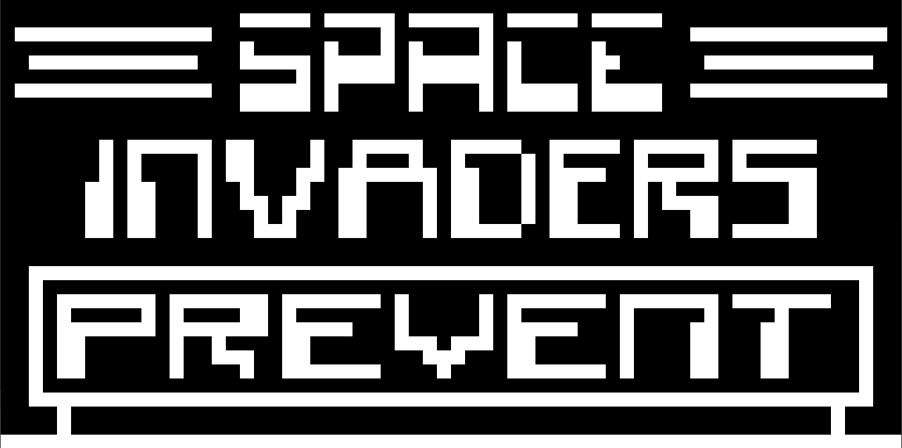

<h1 align="center">
  <b>Oxide - Chip8</b>
   
</h1>

Oxide is a modular CHIP-8 emulator written in Rust with an egui/eframe interface, multilingual support, debugging tools, and configurable input/video/audio settings.
It is compatible with Windows, macOS, and Linux.
<h1 align="center">
  
  
  
   
  <b>Windows 11</b>
  <b>Linux</b>
  <b>macOS</b>
   
</h1>
  
  <h1 align="center">
  
  
  
   
  </h1>

<h1 align="left">
  Gallery :
      

|                Space Invaders                 |
| :------------------------------------------: |
|  |

|                    Tetris                    |                    Pong                    |
| :------------------------------------------: | :----------------------------------------: |
|  |  |
