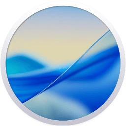
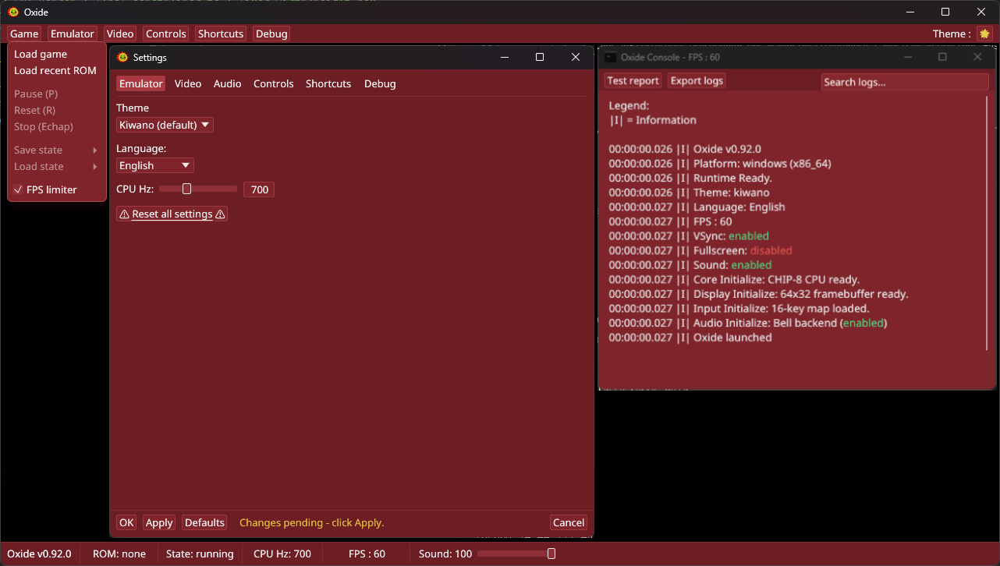
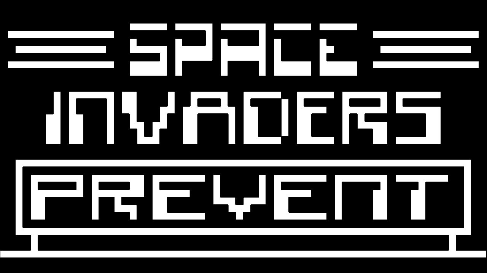
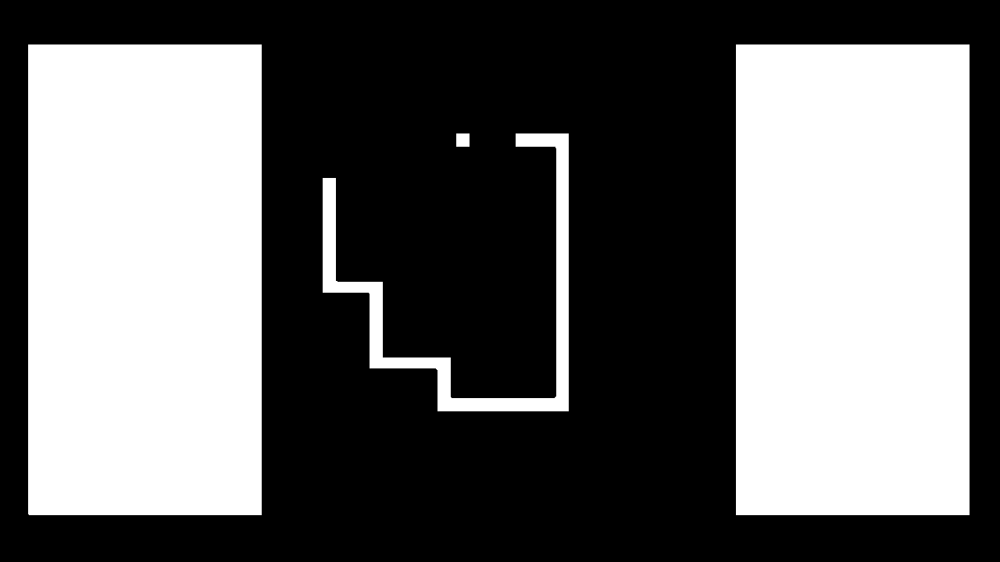
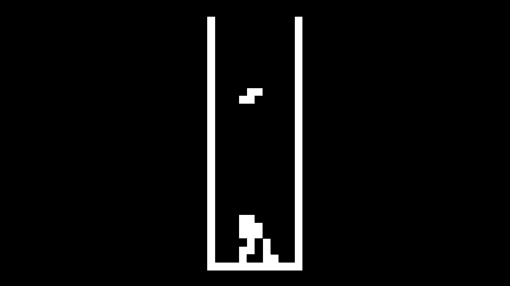
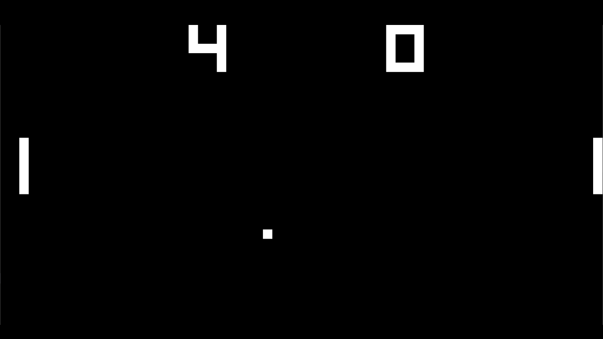

<h1 align="center">
  <b>Oxide</b>
  <br>
  <sub>A modern CHIP-8 emulator written in Rust</sub>
  <br>
  <a href="https://github.com/Ox-Projects/Oxide">
    <picture>
      <source srcset="images/svg/Oxide.svg" type="image/svg+xml">
      
    </picture>
  </a>
  <br>
  
  <a href="https://github.com/Ox-Projects/Oxide/milestones">
    
  </a>
  <a href="https://github.com/Ox-Projects/Oxide/releases">
    
  </a>
  <a href="https://github.com/Ox-Projects/Oxide/releases/latest">
    
  </a>
  
</h1>

### Oxide is a modular CHIP-8 emulator written in Rust with an egui/eframe interface, multilingual support, debugging tools, configurable input/video/audio settings, and a polished desktop experience.
### It is compatible with Windows, macOS, and Linux.

<h1 align="left">🎯 Project Goal :</h1>

This project aims to learn and practice the Rust programming language through a concrete use case: building a CHIP-8 emulator.

It helps to understand key Rust concepts (memory management, structs, ownership, etc.) while also introducing the fundamentals of emulator development, such as the instruction cycle, input/output handling, and graphics rendering.

Beyond simply recreating a basic emulator, the objective is also to design a modern CHIP-8 emulator that includes features and interfaces inspired by contemporary emulators. This includes a user-friendly interface, debugging tools, configurable controls, save states, multilingual support, theme customization, and a polished startup flow.

The goal is to provide a solid foundation for both mastering Rust and understanding how emulators work, making it easier to build similar projects for other systems in the future.

<h2>
  To view the project roadmap :
  <a href="https://github.com/Ox-Projects/Oxide/blob/main/ROADMAP.md">ROADMAP.md</a>
</h2>

<h1 align="left">Compatibility :</h1>
<p align="center">
  <a href="https://github.com/Ox-Projects/Oxide/releases">
    <picture>
      <source srcset="images/svg/W11.svg" type="image/svg+xml">
      
    </picture>
  </a>

  <a href="https://github.com/Ox-Projects/Oxide/releases">
    <picture>
      <source srcset="images/svg/Linux.svg" type="image/svg+xml">
      
    </picture>
  </a>

  <a href="https://github.com/Ox-Projects/Oxide/releases">
    <picture>
      <source srcset="images/svg/Tahoe.svg" type="image/svg+xml">
      
    </picture>
  </a>
  <br>
  <p align="center"><b>Windows 11, Linux and macOS</b></p>
</p>

<h1 align="left">Emulator :</h1>
<p align="center">
  <picture>
    <source srcset="images/svg/Window.svg" type="image/svg+xml">
    
  </picture>
</p>

<h1 align="left">Gallery :</h1>

|                Space Invaders                 |                   Snake                   |
| :------------------------------------------: | :--------------------------------------: |
| <picture><source srcset="./images/svg/SpaceInvaders.svg" type="image/svg+xml"></picture> | <picture><source srcset="./images/svg/Snake.svg" type="image/svg+xml"></picture> |

|                    Tetris                    |                    Pong                    |
| :-----------------------------------------: | :----------------------------------------: |
| <picture><source srcset="./images/svg/Tetris.svg" type="image/svg+xml"></picture> | <picture><source srcset="./images/svg/Pong.svg" type="image/svg+xml"></picture> |

<h1 align="left">Features :</h1>

- 🎮 Full CHIP-8 CPU (35 opcodes) with configurable quirks (CHIP-8, CHIP-48, SUPER-CHIP)
- 🖥️ 64×32 pixel display with 1x–5x scaling, fullscreen, and VSync support
- 🔊 Audio buzzer with volume control
- 🕹️ Keyboard, mouse and gamepad support (`gilrs`)
- 💾 Save/Load states (3 slots per ROM)
- 🌍 12 languages (EN, FR, ES, IT, DE, PT, RU, ZH, JA, KO, AR, HI)
- 🎨 Three themes: Kiwano, Dark, and Light
- ✨ Animated splash screen with logo and version display
- 🔧 Configurable controls and keyboard shortcuts
- 🖥️ Debug terminal with search, export and live diagnostics
- 🪟 Detached Settings and Debug Terminal windows
- 🔒 Windows single-instance protection
- 📚 Technical documentation and GitHub wiki

<h1 align="left">Getting Started :</h1>

1. Download the latest release for your OS
2. Extract the zip
3. Run `Oxide.exe` (or build from source)
4. Click **Game → Load game** and select a `.ch8`, `.rom`, or `.bin` file

### Run from source

```bash
cargo run
```

### Build a release binary

```bash
cargo build --release
```

<h1 align="left">Controls :</h1>

The CHIP-8 uses a 16-key hexadecimal keypad mapped to your keyboard by default :

| 1 | 2 | 3 | C |
|:------:|:---:|:---:|:---:|
| 4 | 5 | 6 | D |
| 7 | 8 | 9 | E |
| A | 0 | B | F |

All bindings are fully configurable in **Settings → Controls**.

Common defaults:
- `O`: Load game
- `P`: Pause / Resume
- `R`: Reset ROM
- `Esc`: Stop emulation
- `F11`: Fullscreen
- `F1-F3`: Save state slots 1-3
- `F5-F7`: Load state slots 1-3

<h1 align="left">Documentation :</h1>

- [ROADMAP.md](ROADMAP.md)
- [docs/ARCHITECTURE.md](docs/ARCHITECTURE.md)
- [docs/CPU_EMULATION.md](docs/CPU_EMULATION.md)
- [docs/SAVE_STATES.md](docs/SAVE_STATES.md)
- [docs/UI_SETTINGS.md](docs/UI_SETTINGS.md)
- [docs/DEVELOPMENT.md](docs/DEVELOPMENT.md)
- [docs/DEBUG_LOGGING.md](docs/DEBUG_LOGGING.md)
- [GitHub Wiki](https://github.com/Ox-Projects/Oxide/wiki)

<h1 align="left">Built With :</h1>

- [Rust](https://www.rust-lang.org/)
- [egui / eframe](https://github.com/emilk/egui)
- [rodio](https://github.com/RustAudio/rodio)
- [gilrs](https://gitlab.com/gilrs-project/gilrs)
- [rfd](https://github.com/PolyMeilex/rfd)
- [image](https://crates.io/crates/image)
- [zip](https://crates.io/crates/zip)
- [chrono](https://crates.io/crates/chrono)

<h1 align="left">License :</h1>

[MIT](LICENSE)
