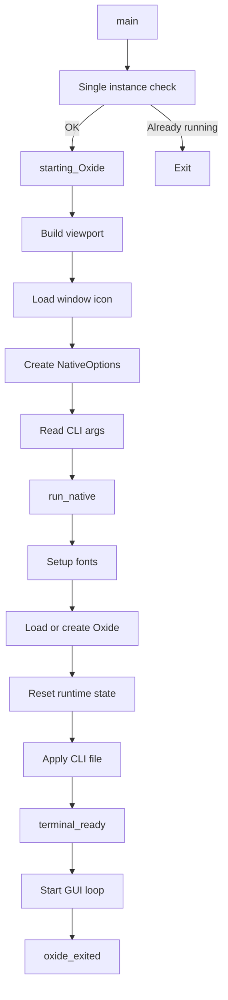

# Application Startup

This document describes how the application initializes and starts.

## Startup Flow

## Key Points

- The application starts from `main`.
- A single-instance check is performed on Windows.
- A splash screen viewport is created before launching the app.
- The GUI is powered by `eframe`.
- The main application state is handled by the `Oxide` struct.
- Runtime state is reset on each startup.

---
