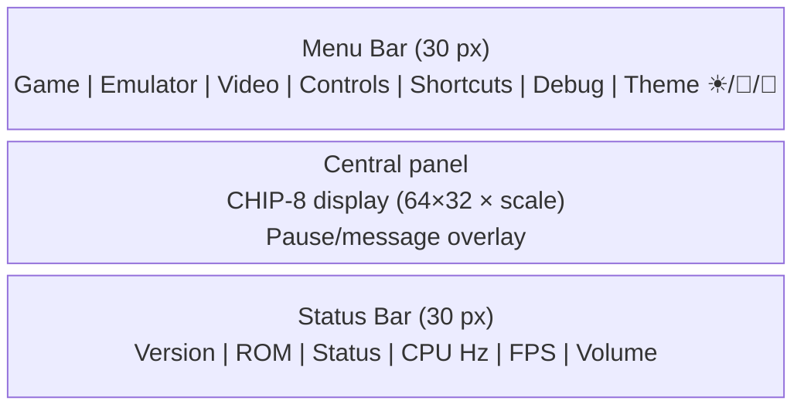
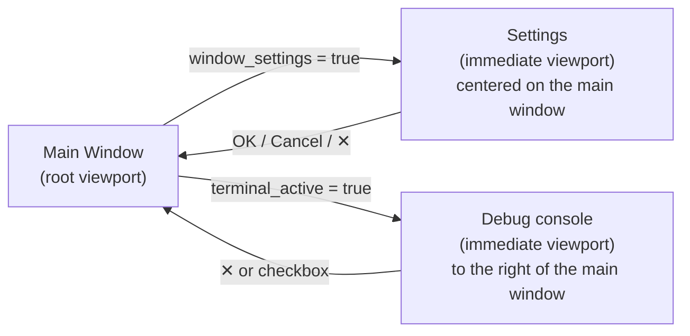
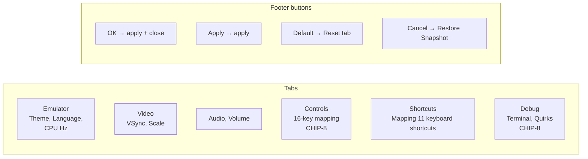
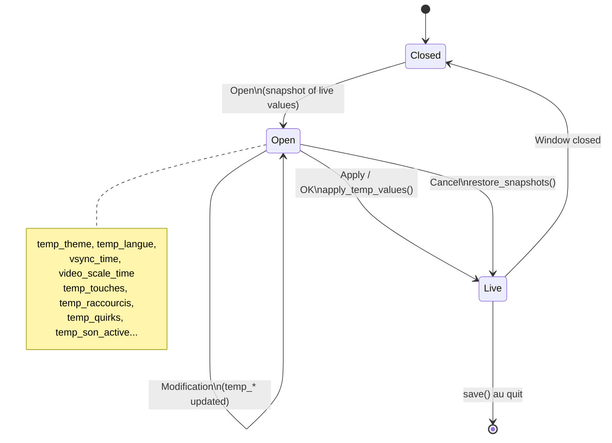
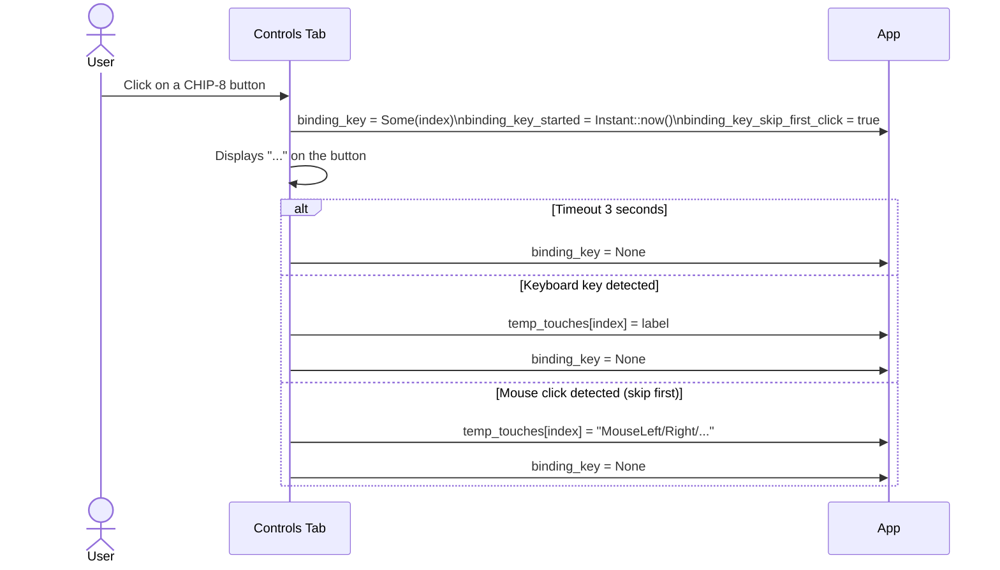
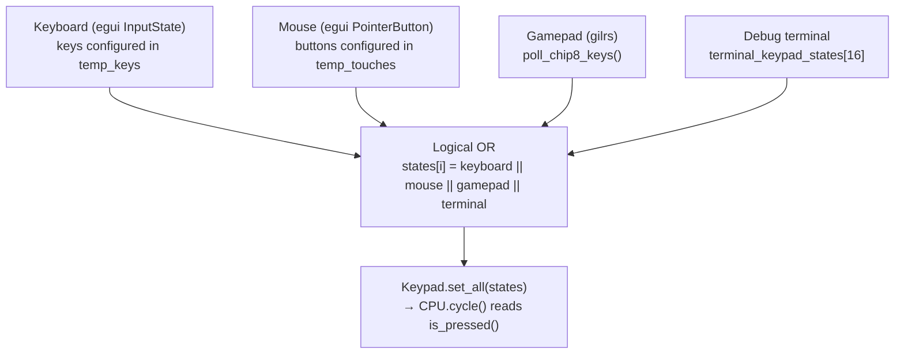
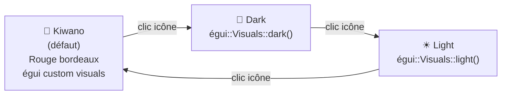
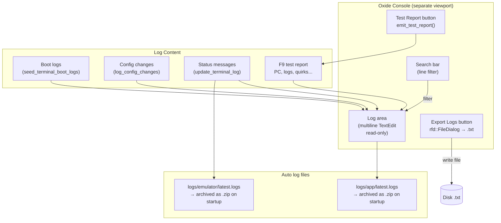

# Oxide — User Interface & Settings

Documentation of the graphical user interface, windows, and parameter flow.

---

## Main Window Layout

---

## Secondary windows (detached viewports)

---

## Settings tabs

---

## Temporary data flow (settings)

---

## Key Bindings (Controls)

---

## Keyboard Input Pipeline → CHIP-8

---

## Available themes

---

## Debug Console — Features

